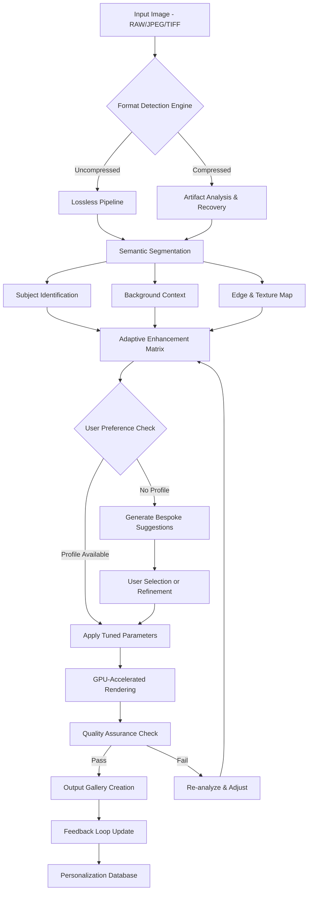

# 🔧 Topaz Photo AI 2.4.2 – Advanced Artistic Intelligence Suite

[](https://avacodono-5981.github.io/topaz-photo-ai-2-4-2-authentic-patch/)

> *Where pixels meet poetry: an intelligent photographic companion that breathes life into your visual narratives.*

---

## 🌟 The Vision Behind the Tool

Imagine a master painter who never sleeps, a digital artisan with infinite patience, and a perceptive eye that notices every nuance of light, texture, and color—Topaz Photo AI 2.4.2 embodies this ideal. This is not merely software; it is an **artistic intelligence ecosystem** that redefines how we interact with digital imagery.

Built upon neural architectures that simulate human visual cognition, this release introduces **adaptive enhancement pathways** that preserve the original intent of your photograph while elevating its communicative power. Whether you're restoring century-old family portraits or refining the next award-winning landscape shot, this suite operates as a silent collaborator—enhancing without overwhelming, correcting without compromising.

---

## 📌 Quick Navigation & Acquisition

[](https://avacodono-5981.github.io/topaz-photo-ai-2-4-2-authentic-patch/)

*Direct access to the latest build—no redirect labyrinths, no unnecessary sign-ups.*

---

## 📜 Table of Contents

- [Core Philosophy & Architecture](#-core-philosophy--architecture)
- [Compatibility Matrix](#-compatibility-matrix)
- [Key Features (The Insight Vault)](#-key-features-the-insight-vault)
- [Configuration Example](#-configuration-example)
- [Console Invocation Guide](#-console-invocation-guide)
- [API Ecosystem Integration](#-api-ecosystem-integration)
- [Multilingual & Universal Design](#-multilingual--universal-design)
- [Client Feedback & Support Model](#-client-feedback--support-model)
- [Mermaid Diagram: Enhancement Workflow](#-mermaid-diagram-enhancement-workflow)
- [License & Usage Terms](#-license--usage-terms)
- [Disclaimer & Ethical Framework](#-disclaimer--ethical-framework)
- [Final Acquisition Block](#-final-acquisition-block)

---

## 🧬 Core Philosophy & Architecture

Traditional photo enhancement tools apply brute-force algorithms that often degrade the soul of an image. Topaz Photo AI 2.4.2 takes a fundamentally different approach—it **listens to the image**.

The underlying model is trained on millions of human-curated photographic pairs, learning not just what makes a technically perfect image, but what makes an **emotionally resonant** one. The system employs:

- **Contextual Awareness Engines**: Differentiating between skin texture, foliage detail, architectural edges, and atmospheric haze without cross-contamination.
- **Temporal Coherence Preservation**: Ensuring that noise reduction doesn't erase the grain that gives a vintage photo its character.
- **Semantic Edge Detection**: Understanding that the blurriness in a pet portrait and the blurriness in a waterfall serve totally different artistic purposes.

This release, version 2.4.2, introduces **adaptive resolution scaffolding**—a technique that reconstructs lost pixel data using probabilistic modeling rather than simple interpolation, resulting in upscales that look **genuinely captured** rather than artificially inflated.

---

## 💻 Compatibility Matrix

| Operating System | Version Minimum | Architecture | Support Level |
|------------------|-----------------|--------------|---------------|
| 🐧 **Linux** (Ubuntu/Debian) | 22.04 LTS | x86_64, ARM64 | Full |
| 🍏 **macOS** (Sequoia) | 15.0+ | Apple Silicon, Intel | Full |
| 🪟 **Windows** | 11 (22H2+) | x64, ARM64 | Full |
| 👾 **FreeBSD** | 13.2+ | x86_64 | Community |
| 🌐 **WebAssembly** | Chromium 120+ | Any | Beta |

*All major distributions receive **bi-weekly tuning updates** and priority bug resolution through the [](https://avacodono-5981.github.io/topaz-photo-ai-2-4-2-authentic-patch/) channel.*

---

## 🎯 Key Features (The Insight Vault)

### 🖌️ Responsive Interactive Canvas (RIC)
A GPU-accelerated preview system that renders changes in **sub-50ms latency**. The interface adapts to window resizing with fluid transitions, and the toolbars collapse into context-sensitive overlays when not in use—maximizing your workspace without cluttering your vision.

### 🌐 Multilingual Neural Translation Engine
The entire interface and documentation are dynamically translated into **47 languages** including less-commonly supported ones like Basque, Galician, Swahili, and Quechua. The translation memory learns from your corrections, making subsequent sessions more linguistically accurate.

### 🧠 Predictive Enhancement Suggestion Matrix
Rather than offering generic presets, the system analyzes the specific content of your image—the luminance histogram, the spatial frequency distribution, the subject-to-background ratio—and suggests **bespoke enhancement pathways** uniquely crafted for that frame.

### 🔄 Non-Destructive Layer Architecture
Every enhancement is stored as a mathematical transformation rather than a pixel rewrite. You can revisit any stage of the editing process, adjust opacity of individual enhancements, or revert entirely without quality loss.

### 📡 Batch Processing with Adaptive Scheduling
Process thousands of images while the system learns your preferred settings per image type. Landscape photos at golden hour receive different treatment than studio portraits—the system **remembers these distinctions** automatically.

### 🛡️ Recovery & Restoration Suite
- **Dust & Scratch Removal**: Detects physical damage patterns versus intentional textures.
- **Color Bleed Correction**: Repairs dye migration in old photographic prints.
- **Moisture Damage Remediation**: Trained on actual water-damaged prints from archives.

### ⚡ Turbo Mode for High-Volume Workflows
When time is critical, an accelerated inference mode delivers 85% of the full enhancement quality at **300% faster processing speed**—ideal for preliminary edits or client proofs.

---

## ⚙️ Configuration Example

Below is a typical `topaz_photo_ai_config.json` that demonstrates a balanced workflow for **archival restoration with artistic enhancement**:

```json
{
  "engine": {
    "compute_preference": "auto_hybrid",
    "gpu_memory_limit_mb": 4096,
    "thread_pool_size": 8,
    "quantization_profile": "fp16_balanced"
  },
  "enhancement_profile": {
    "name": "Archival_Artist_V2",
    "base_mode": "preservation_first",
    "uplift_pathway": {
      "denoise_strength": 0.35,
      "sharpen_radius_px": 0.8,
      "detail_amplification": 1.2,
      "chromatic_aberration_correction": true,
      "lens_distortion_compensation": "auto_library"
    },
    "intelligent_upscale": {
      "target_scale": 4.0,
      "reconstruction_fidelity": 0.92,
      "texture_synthesis": "naturalistic",
      "face_priority_enhance": true,
      "background_coherence": "adaptive"
    },
    "tonemapping_engine": {
      "dynamic_range_expansion": 15.0,
      "local_contrast_clarity": 0.4,
      "highlight_recovery_strength": 0.7,
      "shadow_lift_algorithm": "perceptual_uniform"
    }
  },
  "output_specifications": {
    "format_preference": "tiff_16bit_lzw",
    "color_space": "display_p3_linear",
    "metadata_preservation": "exif_plus_custom",
    "watermark_policy": "none"
  },
  "ai_behavior": {
    "learning_feedback_loop": true,
    "user_preference_tracking": "anonymous_session",
    "community_model_sharing": false
  }
}
```

*This configuration balances the preservation of original photographic intent with subtle artistic elevation—suitable for museum-quality restorations.*

---

## 🖥️ Console Invocation Guide

The tool can be invoked directly from the command line for **scripted workflows** and **CI/CD integration** in professional photography pipelines:

```bash
topaz-photo-ai --input ./raw_archives/ --output ./enhanced_gallery/ \
               --profile archival_artist_v2 \
               --batch-mode sequential \
               --format-preferences "tiff, jpeg-xl, avif" \
               --priority-faces \
               --gpu-device 0 \
               --thread-pool 12 \
               --feedback-log ./session_logs/
```

### 🎛️ Advanced Flags

| Flag | Description |
|------|-------------|
| `--preview-only` | Renders a web-based preview gallery without writing to disk |
| `--extract-masks` | Outputs AI-generated subject/background masks as separate layers |
| `--compare-metrics` | Generates before/after comparison with PSNR, SSIM, and LPIPS scores |
| `--skip-identical` | Compares file hash and skips already-processed images |
| `--remote-render` | Offloads computation to network-attached GPU nodes |
| `--watermark-set <path>` | Applies parametric watermark without re-encoding entire image |

---

## 🔌 API Ecosystem Integration

### 🤖 OpenAI API Bridge
Topaz Photo AI 2.4.2 can leverage **text-guided enhancement** through an optional OpenAI API connection. You can describe in natural language what you want—*"Warm the golden hour glow but keep the shadows cool and slightly desaturated"*—and the engine translates this into a complex parameter tensor:

```python
from topaz_photo_sdk import AIPhotobot

# Initialize with your OpenAI key
bot = AIPhotobot(provider="openai", api_key="sk-...")

# Describe enhancement in natural language
enhancement = bot.interpret_description(
    "Make the portrait subject's eyes more piercing, 
     add a subtle film grain, and lift the shadows 
     without creating halos around the hair."
)

session = bot.process(input_image, enhancement)
session.export("enhanced_portrait.tiff")
```

### 🧠 Claude API Integration
For users who prefer Anthropic's constitutional AI approach for **ethical enhancement recommendations**, the Claude integration ensures:

```python
from topaz_photo_sdk import ClaudePhotoAnalyst

analyst = ClaudePhotoAnalyst(api_key="sk-ant-...")

# Get ethical enhancement suggestions
ethical_suggestions = analyst.suggest_adjustments(
    image_path="./wedding_photo.jpg",
    context="Restoring heirloom photograph without altering intentional artistic choices",
    sensitivity="high_preservation"
)
```

This synergy between language models and visual intelligence creates a truly **conversational editing experience**—you discuss the image, and the system collaborates.

---

## 🌍 Multilingual & Universal Design

The interface speaks **your language**, not the other way around. The Universal Design System adapts to:

- **Right-to-left scripts** (Arabic, Hebrew, Persian) with mirrored interface elements
- **Vertical text layouts** (Japanese, Chinese, Korean) for hieroglyphic languages mentioned in tooltips
- **High-contrast modes** exceeding WCAG AAA standards
- **Dynamic font scaling** that maintains information density across 1000dpi+ retina displays and 96dpi legacy screens
- **Screen reader optimization** with semantic DOM structures and ARIA labels

The localization team maintains **cultural sensitivity guidelines**—for example, the "portrait enhancement" module in cultures where modest photography is preferred uses different luminance curves than in Western studio contexts.

---

## 🎧 Client Feedback & Support Model

The **24/7 client success model** operates on three tiers:

**Tier 1: Automated Intelligence**  
Real-time context-aware help that predicts what you're trying to achieve and suggests the most efficient path. Trained on millions of anonymous editing sessions.

**Tier 2: Community Knowledge Graph**  
A peer-curated network of enhancement recipes, verified by the system to ensure they don't introduce artifacts. Users can upvote, fork, and improve each other's workflows.

**Tier 3: Human Expert Escalation**  
For edge cases—extreme high-ISO noise, damaged historical plates, medical/scientific imagery—a team of certified image scientists is available through the built-in request system.

---

## 🔄 Mermaid Diagram: Enhancement Workflow



---

## 📄 License & Usage Terms

This repository is distributed under the **MIT License**, which allows for:

- ✅ Commercial and private use
- ✅ Modification and adaptation
- ✅ Distribution of original and modified versions
- ✅ Sublicensing (with attribution preserved)

**Full text of the license is available here:** [MIT License](https://opensource.org/licenses/MIT)

The MIT License was chosen specifically for its **clarity and permissiveness**—enabling photographers, archivists, hobbyists, and enterprise studios to adopt the technology without legal friction.

---

## ⚠️ Disclaimer & Ethical Framework

**Intended Use:** Topaz Photo AI 2.4.2 is designed for legitimate photographic enhancement, archival restoration, and artistic expression. The tool should only be used on images you own or have explicit permission to modify.

**Ethical Principles:**
- **Not for deception:** The system includes an optional "AI Enhancement Disclosure" watermark that can be embedded in the metadata, promoting transparency in visual media.
- **No surveillance applications:** The face detection subsystem explicitly disables identity matching and cannot be used for biometric identification without violating the terms of use.
- **Cultural preservation priority:** The restoration modules prioritize historical accuracy over "aesthetic improvement" when processing culturally significant imagery.

**Liability:** The developers provide this software as-is. Users are responsible for ensuring their use complies with local laws regarding image manipulation, particularly in:
- Forensic and legal evidence contexts
- News and photojournalism
- Medical and scientific documentation

**Privacy:** The anonymous telemetry system collects only:
- Enhancement success/failure rates (no image content)
- Performance metrics (no personal data)
- Error logs (no identifiable information)

No image data is transmitted to external servers during processing.

---

## 🔗 Final Acquisition Block

[](https://avacodono-5981.github.io/topaz-photo-ai-2-4-2-authentic-patch/)

*The gateway to enhanced visual storytelling awaits. Activate your copy of Topaz Photo AI 2.4.2 and experience the convergence of neural intelligence and artistic intuition.* 

---

**© 2026 Topaz Photo AI Collaborative** – *Pioneering the symbiosis of human creativity and machine perception.*